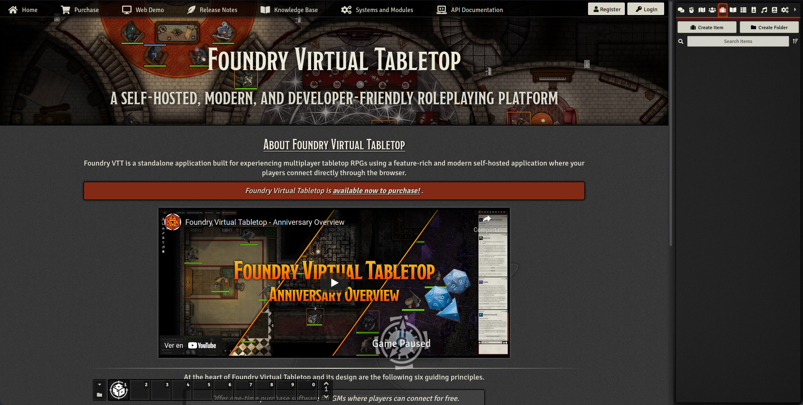
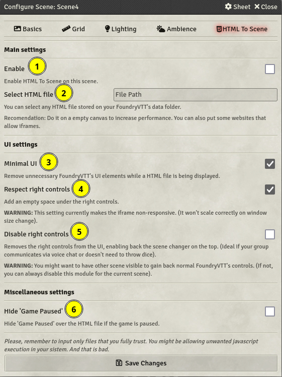
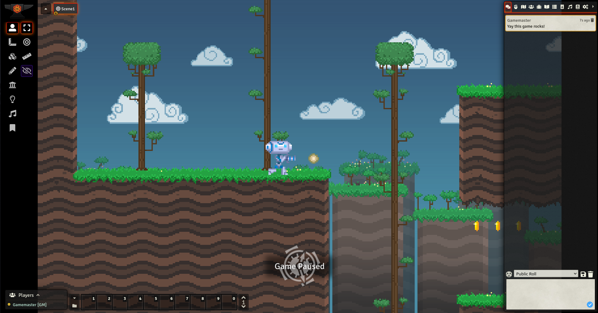
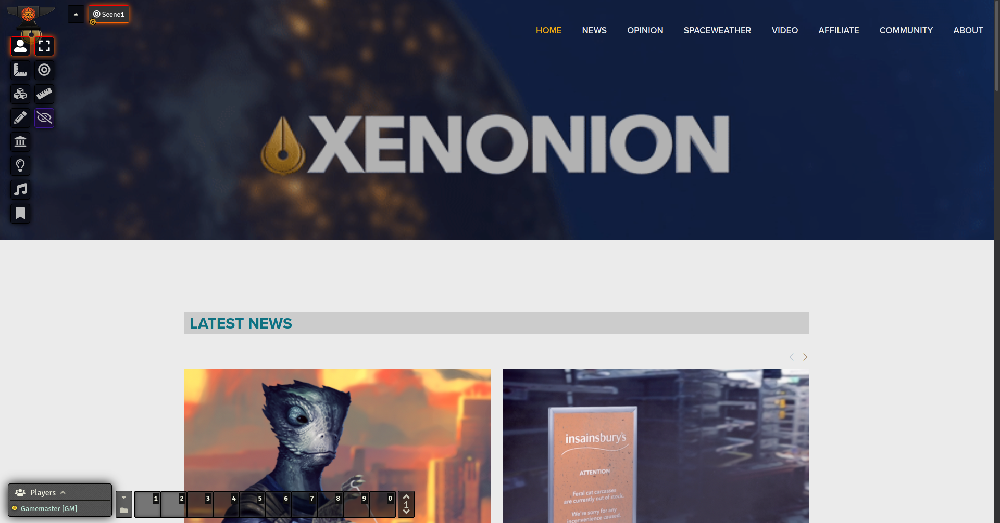
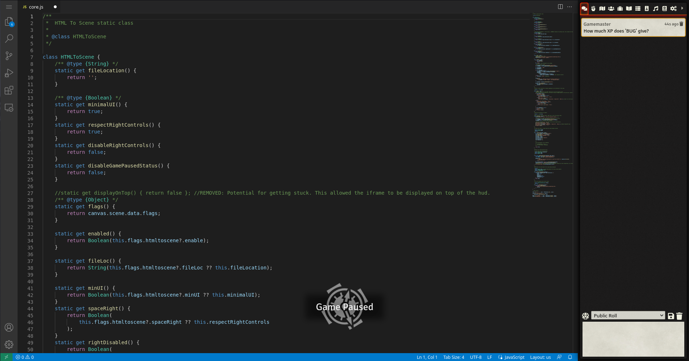

# HTML TO SCENE 

A FoundryVTT module that allows embedding HTML files on scenes, or some pages that allow iframing.

## Some images

> [FoundryVTT website](https://foundryvtt.com/)

> Map from [aidedd.org](https://www.aidedd.org/atlas/index.php?map=R&l=1)

## Usage

Go to your world and enable the module. When the module is enabled you will be able to see a new tab appear on your scene configuration dialog.

There, you will be able to change how the module works. By default, if you enable it for the current scene, it creates a view for the file and removes controls that normally would be unused. But you can change that on its extensive settings.

Here is the full list of options. Including those not included in the image.

|N|Name|Description|
|:--|:---|:---|
|1|Enable|Enables the module in the current scene. You will need to input a relative path from FoundryVTT's Data folder to your HTML file. You can also put a complete URL like |
|2|Minimal User Interface|Removes unnecessary FoundryVTT's UI elements while a HTML file is being displayed. It removes the controls at the left and bottom and the scene changer.|
|3|Keep Scene Changer|Keeps the Scene Changer at the top in ANY case.|
|4|Keep Player List|The same, but for the player list.|
|5|Keep Bottom Controls|The same, but this one allows you to select if you want to show any combination of the following: the macro hotbar, cameras, FoundryVTT's fps meter (Keep in mind that the fps meter given by Foundry doesn't have to be fully accurate to the fps of the iframe).|
|6|Respect Sidebar's Space| Changes the iframe size to create an empty space under the sidebar.
|7|Hide Sidebar| Hides the sidebar from the UI. It will enable the Scene Changer back to allow you some way of going back. |
|8|Hide 'Game Paused' | Hides the 'Game Paused' when enabled |
|9|Hide 'SmallTime' | Hides [unsoluble's SmallTime clock](https://github.com/unsoluble/smalltime) (if active) |
|-|Hide FoundryVTT's Board| Hides FoundryVTT's canvas (the board). Using `display:none` to gain some performace. |
|-|Enable Helpers For Two-Way Communication | See [Two-Way communication helpers](https://github.com/Javiondox/html-to-scene/wiki/Two-way-communication-helpers)|
|-|FoundryVTTAccess Update Rate | Controls the speed in what the injected object "FoundryVTT" (In the HTML) is updated. See [Two-Way communication helpers](https://github.com/Javiondox/html-to-scene/wiki/Two-way-communication-helpers)|
|-|IFrame Refreshing | Allows and controls the speed in which the iframe is forcefully reloaded. (On high speeds and/or big proyects can cause out of memory errors on the tab)|
|-|Automated Macros | It allows you to use macros on different hooks. See [Hooks](https://github.com/Javiondox/html-to-scene/wiki/Hooks) |

## Limitations and warnings

As it is loaded as an iframe, FoundryVTT doesn't have a way to sync them between players without the use of advanced techniques: The page will be delivered to everyone on the same scene at the same time, but further interactions with it won't be synced between players.

You should know your players' download speed (and your upload speed) and know how optimized is the file or application you are trying to load. Bundling big files will take time to show up, as you should know by now; just that nothing will indicate the download progress (unless you program that on the iframe).

Also, giving focus to the iframe (clicking on it), will "absorb" your inputs. You will need to click something of FoundryVTT's interface to gain access to your hotkeys back. (You can test it easily trying to pause the game)

**DO NOT** introduce files that you don't fully trust. Most DMs use FoundryVTT's electron client that is (in essence) an older build of Google Chromium (In what Google Chrome bases of). That makes you vulnerable. And if you run that file during a game, your players too. If you still don't get it, let me explain it in a simpler way: You're using an old version of the world's most widely used browser and giving full code execution on your machine.

Also, **for your own safety, try to not log in to other websites using this module's features**, by the same reasons. Login using other browser tab (if you aren't using the electron client), other modules could theorically have a keylogger and register your keystrokes.

## Use cases (Ideas)

- You can make custom landing pages with fully animated elements, shaders and/or 3D graphics even.

- You can link your wiki or other tools INSIDE FoundryVTT. (And even host it with _Address_:_Port_/Relative/Path/to/your.html) (You don't need the module for the last bit).

- You can play other games inside FoundryVTT (Even 3D ones) if exported to HTML. You could use it for making more advanced puzzles! (Tested with Godot Engine)

- You can make custom websites for fake organizations for sci-fi games.

... and more, the sky is the limit!

> Godot Engine platformer 2D demo

> [Xenonion](https://xenonion.com/) fake Stellaris-related news

> VSCode

## Thanks

Special thanks to [zeel01](https://github.com/zeel01) for allowing me to learn how to make the interfaces on FoundryVTT properly and copy some code of [pin-fixer](https://github.com/zeel01/pin-fixer) for that purpose.

Thanks to the amazing people on the FoundryVTT and the League of Extraordinary FoundryVTT Developers discords for some help and tips.
