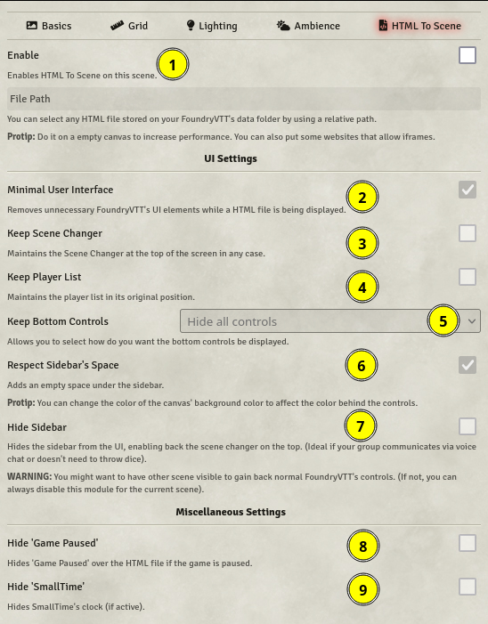

# HTML TO SCENE 

A FoundryVTT module that allows embedding HTML files on scenes.

## Usage

Go to your world and enable the module. When the module is enabled you will be able to see a new tab appear on your scene configuration dialog.

There, you will be able to change how the module works. By default, if you enable it for the current scene, it creates a view for the file and removes controls that normally would be unused. But you can change that on its settings.

1 - Allows the module to create a view on the current scene.

2 - Allows you to indicate the module a path to the HTML file you want to open. (You have to a relative path from the Data folder to the HTML file)

3 - Removes all the UI at the left of the screen, leaving the right controls intact. (By default)

4 - Leaves a space under the right controls (Used if you don't want to render the HTML file under that)

5 - Removes the right controls and, if the 3rd option is enabled, displays back the scene changer at the top (That you can make smaller clicking on the arrow).

6 - Hides 'Game Paused'.

## Limitations and warnings

As it is loaded as an iframe, FoundryVTT doesn't have a way to sync them between players without the use of advanced techniques: The page will be delivered to everyone on the same scene at the same time, but further interactions with it won't be synced between players.

You should know your players' download speed (and your upload speed) and know how optimized is the file or application you are trying to load. Bundling big files will take time to show up. And nothing will indicate the progress of the upload.

**DO NOT** introduce files that you don't fully trust. Most DMs use FoundryVTT's electron client that is (in essence) an older build of Google Chromium (In what Google Chrome bases of). That makes you vulnerable. And if you run that file during a game, your players too. If you still don't get it, let me explain it in a simpler way: You're using an old version of the world's most widely used browser and giving full code execution on your machine.

Also, for your own safety, try to not log in to other websites using this module's features, by the same reasons. Login using other browser tab (if you aren't using the electron client), other modules could theorically have a keylogger and register your keystrokes.

## Use cases (Ideas)

- You can make custom landing pages with fully animated elements, shaders and/or 3D graphics even.

- You can link your wiki or other tools INSIDE FoundryVTT. (And even host it with _Your Address_:3000/Relative/Path/to/your.html) (You don't need the module for the last bit).

- You can play other games inside FoundryVTT (Even 3D ones) if exported to HTML. You could use it for making more advanced puzzles! (Tested with Godot Engine)

- You can make custom websites for fake organizations for sci-fi games.

... and more, the sky is the limit!

## Thanks

Special thanks to [zeel01](https://github.com/zeel01) for allowing me to learn how to make the interfaces on FoundryVTT properly and copy some code of [pin-fixer](https://github.com/zeel01/pin-fixer) for that purpose.

Thanks to the amazing people on the FoundryVTT and the League of Extraordinary FoundryVTT Developers discords for some help and tips.
